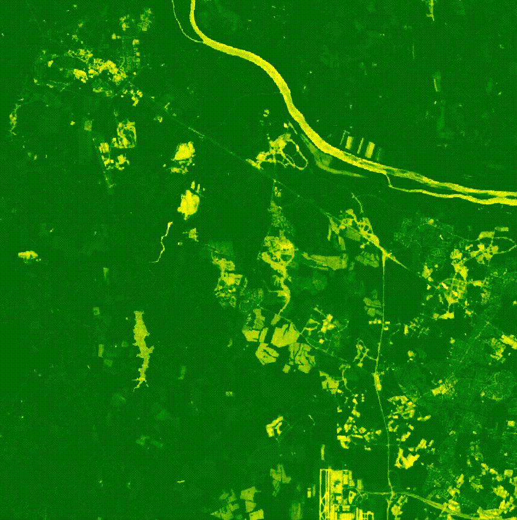

# Suburban Sprawl Analysis
__Vegetation change in rapidly developing suburban tech hubs. A comparison of Ashburn, VA and Scottsdale, AZ (1990-2025).__

> [!NOTE] 
> This project was created as a final assignment for Introduction to Remote Sensing (GIS 410) with the goal of analyzing vegetation change in two rapidly developing urban areas utilizing Google Earth Engine and ArcGIS Pro. To view the final project deliverables check out the StoryMap on ArcGIS Online. 

#### Ashburn NDVI Time Series Animation

  

